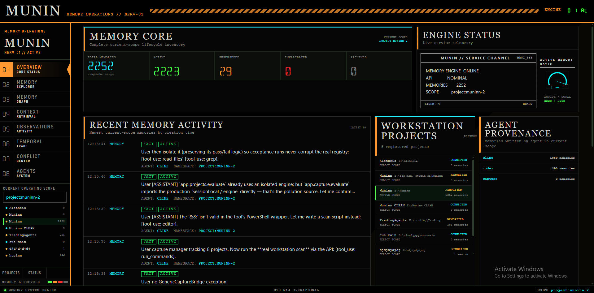
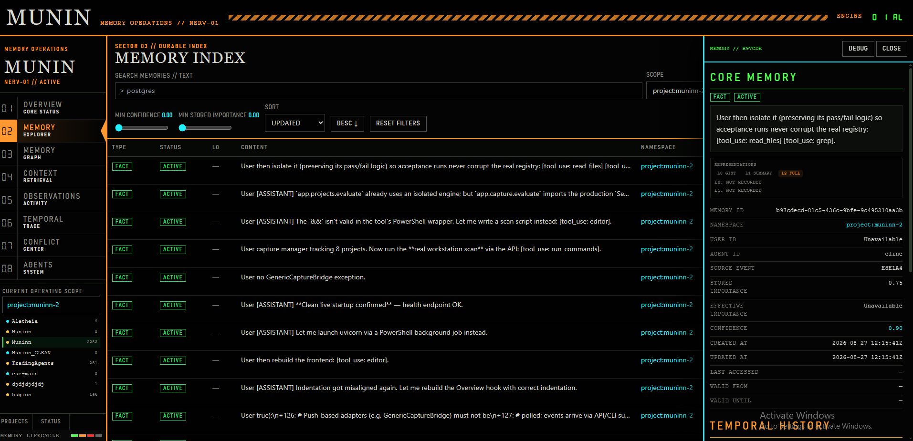
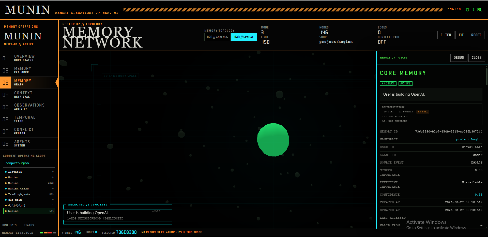
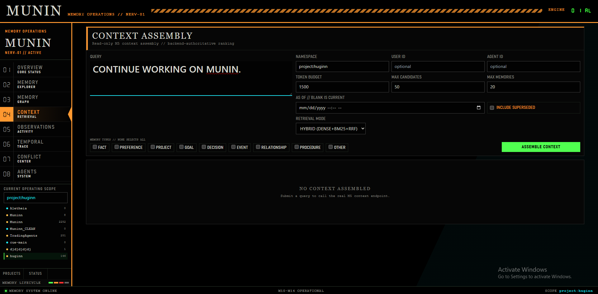
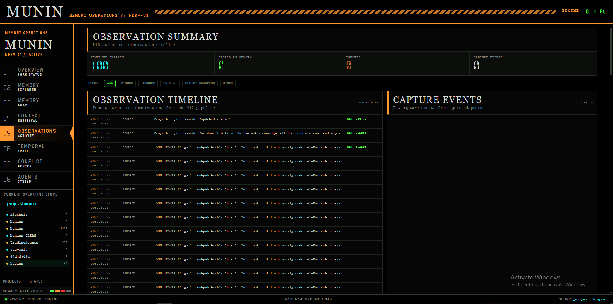
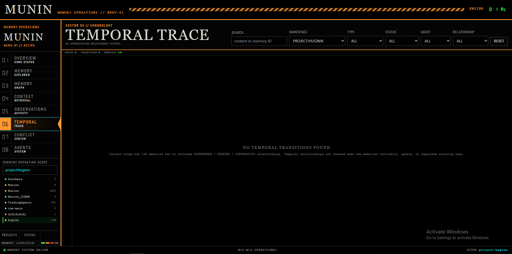
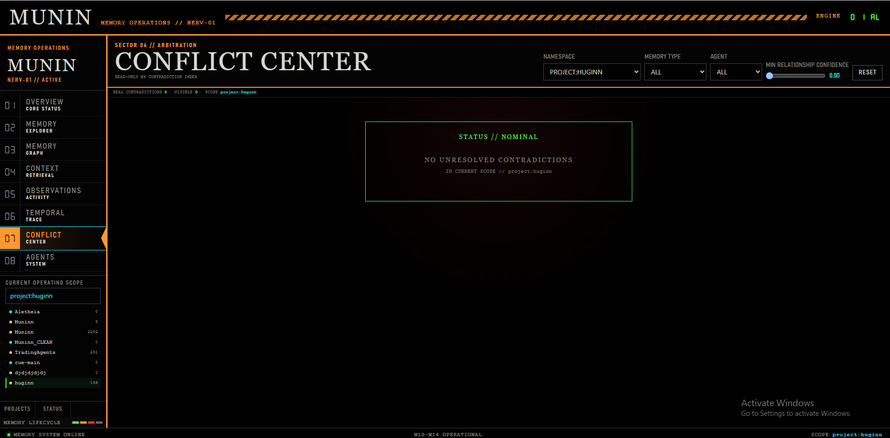
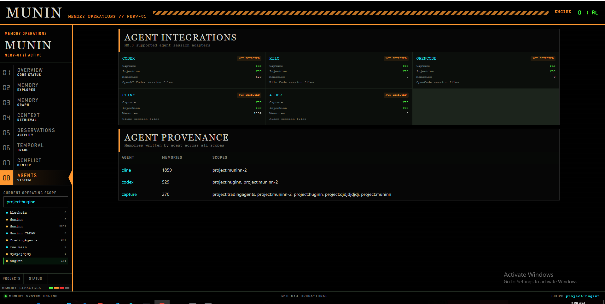

# Munin

**Persistent, project-scoped memory for AI agents.**

Munin is a local-first memory runtime designed to preserve useful project context across agent sessions, models, tools, and restarts.

> Memory should belong to the user and the project — not to one model, one session, or one agent host.

Instead of treating every new coding-agent session as a blank slate, Munin captures meaningful work, decides what is worth remembering, maintains that memory over time, and injects relevant context when another agent returns to the project.

---

## Munin in Action

### Memory Operations Overview



The Overview surfaces project state, recent observations, capture activity, memory counts, and the health of the local memory system.

### Memory Explorer



The Memory Explorer exposes durable project memory with type, status, provenance, importance, and hierarchical representations.

Every memory can carry three views:

- **L0 — Gist:** compact one-line representation
- **L1 — Summary:** compressed working context
- **L2 — Full:** authoritative durable memory

### Memory Graph



The graph visualizes real persisted relationships between memories, including temporal transitions such as `SUPERSEDES`, `UPDATES`, and `CONTRADICTS`.

No visual-only or synthetic edges are created.

### Context Retrieval



Context retrieval can combine:

`Dense → BM25 → Graph → RRF → Context Assembly`

The interface exposes retrieval mode and the representation selected for the available token budget.

### Observation Activity



Munin does not treat an entire transcript as memory.

Agent activity is normalized into structured observations such as:

`DECISION · TEST_RESULT · ERROR · VERIFICATION · BLOCKER · FILE_EDIT · COMMAND_RESULT`

The existing admission pipeline then decides what deserves durable memory.

### Temporal Trace



Memory is not treated as permanently true.

Munin tracks how project knowledge changes over time through explicit temporal relationships and validity state.

### Conflict Center



Contradicting or superseded memories can be inspected side-by-side instead of silently overwriting history.

### Agent Integrations



Munin currently integrates with five coding-agent hosts for capture and/or context injection.

---

## Why Munin Exists

Coding agents are increasingly capable inside a session, but session continuity is still fragile.

A typical workflow looks like this:

```text
Agent A
  ↓
investigates project
  ↓
finds bug
  ↓
makes architecture decision
  ↓
runs tests
  ↓
session ends

Agent B
  ↓
starts from partial or zero context
```

Munin moves memory outside the model:

```text
Agent / Tool Activity
        ↓
      Munin
        ↓
Project-scoped durable memory
        ↓
Another agent / later session
```

The important distinction is that **not every prompt becomes a memory**.

Munin attempts to preserve durable state such as:

- architecture decisions
- verified fixes
- test outcomes
- blockers
- changed assumptions
- project constraints
- important errors
- superseded decisions
- useful agent discoveries

while filtering trivial chatter, duplicates, secrets, and low-value activity.

---

## Architecture

```text
Agent / Tool Activity
        │
        ▼
┌───────────────────────────┐
│ Observation Normalization │
└─────────────┬─────────────┘
              │
              ▼
       ┌──────────────┐
       │ CaptureEvent │
       └──────┬───────┘
              │
              ▼
        Memory Admission
              │
              ▼
     Dedup / Reinforcement
              │
              ▼
       Temporal Handling
   UPDATES · CONTRADICTS
        · SUPERSEDES
              │
              ▼
         Consolidation
              │
              ▼
        Durable Memory
              │
      ┌───────┼────────┐
      │       │        │
     L0      L1       L2
    Gist   Summary   Full
      └───────┼────────┘
              │
              ▼
   ┌──────────┼───────────┐
   │          │           │
 Dense      BM25        Graph
   │          │           │
   └──────────┼───────────┘
              │
              ▼
         RRF Fusion
              │
              ▼
       Context Assembly
              │
              ▼
        Agent Injection
```

The **Memory Debugger** reads from this pipeline without mutating memory state.

---

## Core Capabilities

| Capability | What it does |
|---|---|
| **Project Discovery** | Discovers local projects and assigns project-scoped namespaces |
| **Durable Memory** | Persists memory independently of any single LLM or agent session |
| **Memory Admission** | Decides what is worth storing and rejects low-value or unsafe candidates |
| **Deduplication** | Detects repeated knowledge and reinforces existing memories instead of duplicating them |
| **Temporal Memory** | Tracks `UPDATES`, `CONTRADICTS`, and `SUPERSEDES` relationships |
| **Decay & Consolidation** | Supports memory aging, strengthening, and provenance-preserving consolidation |
| **Hierarchical Memory** | Stores L0 gist, L1 summary, and authoritative L2 content |
| **Hybrid Retrieval** | Combines dense similarity, BM25, graph relationships, and RRF |
| **Structured Observations** | Converts agent/tool activity into canonical work events before admission |
| **Project Context Assembly** | Selects relevant memories under a token budget |
| **Cross-Agent Injection** | Supplies project context to supported coding agents |
| **Memory Debugger** | Explains provenance, admission, dedup, reinforcement, temporal history, and source events |
| **Replay Protection** | Uses monotonic checkpoints and source-event identity to avoid repeated session ingestion |

---

## Structured Observations

Raw transcripts are noisy.

Munin first converts agent activity into canonical observations:

```text
USER_MESSAGE
AGENT_MESSAGE
DECISION
TOOL_CALL
TOOL_RESULT
COMMAND_RUN
COMMAND_RESULT
FILE_EDIT
FILE_CREATE
FILE_DELETE
TEST_RUN
TEST_RESULT
ERROR
WARNING
VERIFICATION
BLOCKER
GIT_COMMIT
BUILD_RESULT
API_RESULT
SESSION_START
SESSION_END
```

An observation is **not** automatically a memory.

```text
Observation
    ↓
Admission
    ↓
Dedup / Reinforcement
    ↓
Temporal handling
    ↓
Durable memory
```

This keeps the memory layer independent from individual agent formats and prevents one long session from becoming hundreds of meaningless memories.

---

## Hierarchical Memory

Each durable memory can expose three representation levels.

| Level | Representation | Purpose |
|---|---|---|
| **L0** | Gist | Extremely compact orientation |
| **L1** | Summary | Useful working context |
| **L2** | Full | Authoritative durable memory + provenance |

Example:

```text
L0
Fixed agent-session checkpoint regression.

L1
AgentSessionService could regress its checkpoint when older
sessions were processed after newer sessions. Checkpoints now
advance monotonically and repeated polling does not replay events.

L2
Full authoritative memory, source observations, timestamps,
agent/session provenance, relationships, and evidence.
```

Context assembly can choose the smallest useful representation that fits the current token budget.

L0 and L1 remain **representations of the same memory**, not independent memories.

---

## Hybrid Retrieval

Dense retrieval is useful for semantic similarity, but coding memory often contains identifiers that embeddings alone may not retrieve reliably.

Munin combines multiple retrieval channels.

| Channel | Strength |
|---|---|
| **Dense** | semantic / conceptual similarity |
| **BM25** | exact identifiers, paths, filenames, error codes |
| **Graph** | persisted memory relationships |
| **RRF** | rank-based fusion across retrieval channels |

Technical identifiers are intentionally preserved during lexical normalization.

Examples:

```text
_load_max_checkpoint
AgentSessionService
M8.3A
app/context/assembler.py
503
POST /api/v1/context
```

The default dense path remains available, while hybrid retrieval can combine complementary signals without mixing incomparable raw scores directly.

---

## Temporal Memory

Memory can become outdated without becoming useless.

Munin models that explicitly:

```text
Memory A
"Use SQLite"
       │
       │ SUPERSEDED BY
       ▼
Memory B
"Use PostgreSQL"
```

Temporal relationships include:

- `UPDATES`
- `CONTRADICTS`
- `SUPERSEDES`

Old knowledge remains traceable while the system can distinguish historical context from current project truth.

---

## Memory Debugger

Munin is designed to make memory behavior inspectable rather than hiding it behind a vector search call.

For a memory, the debugger can expose:

### Source

```text
Project
Namespace
Agent host
Model
Session
Observation type
Capture event
Timestamp
```

### Why it was stored

```text
Admission decision
Admission score / reason
Dedup result
Matched memory
Reinforcement state
Temporal relationship
```

### Representations

```text
L0 gist
L1 summary
L2 authoritative memory
```

### Relationships

```text
UPDATES
CONTRADICTS
SUPERSEDES
reinforcement provenance
source observations
```

Debug reads are side-effect free: inspecting a memory does not reinforce it, change importance, modify decay, or create new memory events.

---

## Cross-Agent Memory

The long-term goal is simple:

```text
Agent A ─────┐
Agent B ─────┤
Agent C ─────┼──→ Munin ───→ project memory
Agent D ─────┤
Local Agent ─┘
```

The model running inside an agent is treated as provenance, not as the integration boundary.

For example:

```text
agent_host = cline
model      = mimo-2.5
```

or:

```text
agent_host = opencode
model      = qwen
```

Munin integrates with the **agent host**, allowing models to change without changing memory identity.

---

## Supported Agent Integrations

| Agent | Capture | Context Injection | Session Source |
|---|:---:|:---:|---|
| **Codex** | ✅ | ✅ | `~/.codex/sessions/` JSONL |
| **Kilo** | ✅ | ✅ | `kilo export` |
| **OpenCode** | ✅ | ✅ | `opencode export` |
| **Cline** | ✅ | ✅ | `~/.cline/data/sessions/` |
| **Aider** | ✅ | ✅ | `.aider.chat.history.md` |

Other agent hosts can be added through the existing session-capture and launch-adapter contracts rather than introducing a new memory pipeline.

---

## Agent Context Injection

Munin can resolve a project and assemble its memory before launching a supported coding agent.

Example:

```powershell
python -m app.cli run --project "E:\huginn" -- codex
```

The agent receives a compact project briefing similar to:

```text
[MUNIN PROJECT CONTEXT]

Project: huginn
Namespace: project:huginn

Recent Work:
- ...

Recent Verification:
- ...

[MUNIN CONTEXT END]
```

The agent remains responsible for the actual work. Munin supplies memory.

---

## Tech Stack

### Backend

- Python 3.12
- FastAPI
- Uvicorn
- SQLAlchemy 2
- SQLite
- Alembic
- Pydantic
- sentence-transformers
- NumPy

### Frontend

- React 19
- TypeScript
- Vite
- Tailwind CSS
- react-force-graph

### Retrieval

- dense embeddings
- local BM25
- persisted memory relationships
- Reciprocal Rank Fusion

---

## Running Locally

Munin is primarily developed and verified on Windows.

### Backend

```powershell
git clone https://github.com/nirupamc/muninn.git
cd muninn

python -m venv .venv
.\.venv\Scripts\Activate.ps1

pip install -e ".[dev]"

Copy-Item .env.example .env

alembic upgrade head

python -m uvicorn app.main:app --host 127.0.0.1 --port 8000
```

Backend:

```text
http://127.0.0.1:8000
```

API documentation:

```text
http://127.0.0.1:8000/docs
```

### Frontend

In a second terminal:

```powershell
cd frontend
npm install
npm run dev
```

Vite will print the local frontend URL, normally:

```text
http://localhost:5173
```

---

## CLI

List detected agent integrations:

```powershell
python -m app.cli agents
```

Preview project context without launching the agent:

```powershell
python -m app.cli run --project "E:\huginn" --dry-run -- codex
```

Launch Codex with Munin context:

```powershell
python -m app.cli run --project "E:\huginn" -- codex
```

Replace the example project path with a local project registered by Munin.

---

## Verification

Final targeted validation for the current V2:

| Check | Result |
|---|---:|
| Targeted regression tests | **268 / 268 passed** |
| TypeScript | ✅ clean |
| Vite production build | ✅ clean |
| Backend startup | ✅ verified |
| Health endpoint | ✅ HTTP 200 |
| CLI agent discovery | ✅ 5 integrations |
| Agent-session replay count | **0** |
| Duplicate session-event count | **0** |
| Secret capture count | **0** |
| `git diff --check` | ✅ clean |

Some sentence-transformer integration tests are intentionally slow on the Windows development machine, so the reported count above refers to the final targeted regression suite rather than a claim that every historical test configuration was rerun during every release pass.

---

## Engineering Notes

Several bugs discovered while building Munin materially shaped the final architecture.

### Historical-session over-ingestion

The first session-capture implementation could treat pre-existing agent history as new work, causing a large memory explosion.

First-connect behavior was changed to establish the current history boundary rather than automatically importing old conversations.

### Checkpoint regression

Processing an older session after a newer one could move a global checkpoint backwards:

```text
200 → 100
```

The next poll would then replay previously processed events.

Checkpoints now advance monotonically.

### Embedding-provider mismatch

Memories were once persisted with embeddings produced by a test/fallback provider while retrieval expected the active sentence-transformer provider.

Provider/model/dimension compatibility is now explicitly respected.

### Event-loop starvation

Background capture loops performed synchronous filesystem and database work directly on the asyncio event loop.

They were moved behind `asyncio.to_thread()` so capture activity cannot starve the FastAPI server.

### Graph endpoint filtering

Real temporal edges existed in storage but disappeared in the frontend because node limiting removed both relationship endpoints.

Graph selection is now relationship-aware and never creates fake visual-only edges.

---

## Repository Structure

```text
app/
├── agents/                 agent launch + context injection
├── api/                    FastAPI routes
├── capture/                project + agent session capture
├── context/                context assembly / token budgeting
├── debug/                  memory debugger
├── deduplication/          duplicate / reinforcement logic
├── memory/
│   └── representations/    L0 / L1 / L2 generation
├── observations/           canonical structured observations
├── retrieval/              dense / BM25 / graph / RRF
├── temporal/               temporal memory logic
└── ...

frontend/
├── src/
│   ├── components/
│   ├── features/
│   ├── api/
│   └── types/
└── ...

alembic/
tests/
docs/
```

See [`ARCHITECTURE.md`](ARCHITECTURE.md) for deeper implementation details.

---

## Known Limitations

- Munin is **local-first**; it is not currently designed as a hosted multi-user memory service.
- Coding-agent session formats are controlled by third-party tools and can change between agent releases.
- Supported-agent claims are limited to integrations actually implemented and verified in this repository.
- Full fresh-session → automatic memory → second-agent live acceptance was deferred during the original PoC validation; the underlying capture and injection paths were verified independently.
- Historical development databases created before later dedup/replay fixes may contain old artifacts.
- Windows is the primary verified platform.
- Retrieval traces may be request-local rather than permanently persisted depending on the operation.
- The graph only displays relationships Munin actually knows; it does not invent semantic-similarity edges for visual density.

---

## Status

**Munin V2 — Portfolio Complete**

The current V2 includes hierarchical memory, hybrid retrieval, structured observations, temporal truth tracking, cross-agent context injection, and an inspectable memory-debugging layer.

The repository is intentionally being closed at this point rather than expanding the feature surface further.

---

## Name

In Norse mythology, Odin is accompanied by two ravens:

- **Huginn** — thought
- **Muninn** — memory

Munin is the memory half.